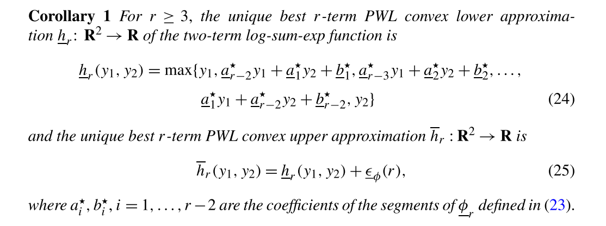
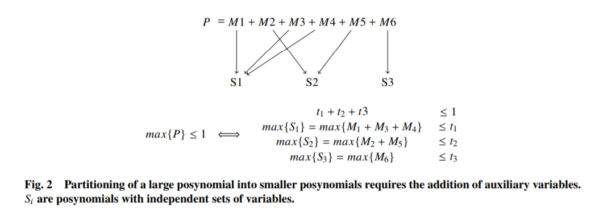
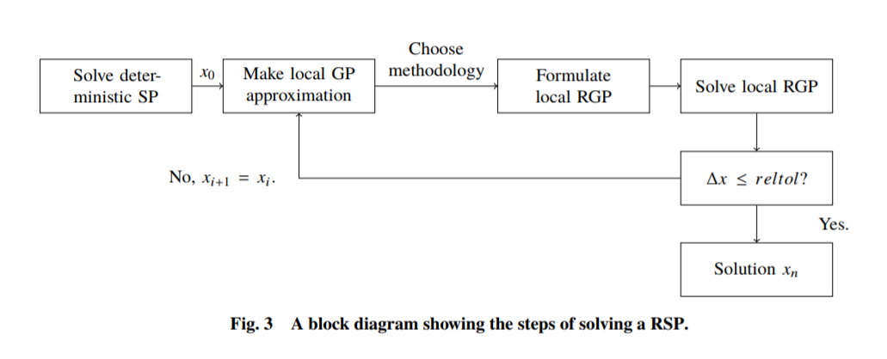

Mathematical moves for robust GPs/SPs
*************************************

There are 5 mathematical steps to being able to apply principles
from linear robust optimization to geometric and signomial programming.

- Linear programs (LPs) have tractable robust counterparts.
- Two-term posynomials are LP-approximable.
- All posynomials are LP-approximable.
- GPs have robust formulations.
- RSPs can be represented as sequential RGPs.

As a quick demonstration, we paraphrase the foundational works of mathematics,
in order of application,
that allow us to come up with robust counterparts for GPs and SPs.

Linear programs (LPs) have tractable robust counterparts.
~~~~~~~~~~~~~~~~~~~~~~~~~~~~~~~~~~~~~~~~~~~~~~~~~~~~~~~~~

This is a seminal finding by [Ben-Tal, 1999] that derives the robust counterpart for
a linear program given different types of bounded uncertainty sets.
One of the problems they detail is below,
which is a linear program in which the coefficients :math:`\mathbf{a}_i` are subject
to an affine perturbation by uncertain parameters :math:`u_i`, which are contained in an ellipsoidal
uncertainty set.

.. math::

    \text{min} &~~\mathbf{c}^T\mathbf{x} \\
    \text{s.t.}     &~~\mathbf{a}_i\mathbf{x} \leq b_i,~\forall \mathbf{a}_i \in \mathcal{U}_i,~i = 1,\ldots,m, \\
                    &~~\mathcal{U} = \{(\mathbf{a}_1, \ldots, \mathbf{a}_m): \mathbf{a}_i = \mathbf{a}_i^0 + \Delta_i u_i, ~i = 1,\ldots,m,
                    ~~~\left\lVert u \right\rVert_2 \leq \rho\}

The robust counterpart for the above linear program is given by the following:

.. math::

    \text{min} &~~\mathbf{c}^T\mathbf{x} \\
    \text{s.t.}&~~\mathbf{a}_i^0 \leq b_i - \rho\left\lVert \Delta_i\mathbf{x} \right\rVert_2,~\forall i = 1,\ldots,m, \\

This is tractable second-order cone program.

Two-term posynomials are LP-approximable.
~~~~~~~~~~~~~~~~~~~~~~~~~~~~~~~~~~~~~~~~~

We were not the first people interested in robust GPs formulations. Folks from
Stephen Boyd's group at Stanford took the first concrete steps to combine principles of robust linear programming
with GPs. Work described in [Hsiung, 2008] paves the way for low-error piecewise-linear (PWL) approximations
of posynomials.

|picHsiung|

For derivation of robust GPs, the central finding is in Corollary 1 of the paper,
which asserts that there is an analytical solution for the lowest-error
lower and upper approximation of a two-term posynomial in log-space. An image of the corollary
of the paper is above; the proof can be found in the paper.

All posynomials are LP-approximable.
~~~~~~~~~~~~~~~~~~~~~~~~~~~~~~~~~~~~

We use the PWL two-term posynomial approximation above to approximate any posynomial
with PWL approximations of two-term posynomials. The full recipe is described by [Saab, 2018];
here we demonstrate with a simple example from the paper. The following problem

.. math::

    \text{min} &~~f \\
    \text{s.t.}&~~\text{max}\{M_1 + M_2 + M_3 + M_4\} &\leq 1 \\
               &~~\text{max}\{M_5 + M_6\} & \leq 1

is equivalent to

.. math::

    \text{min} &~~f \\
    \text{s.t.}&~~\text{max}\{M_1 +e^{t_1}\} &\leq 1 \\
               &~~\text{max}\{M_2 +e^{t_1}\} &\leq e^{t_1} \\
               &~~\text{max}\{M_3 + M_4\} &\leq e^{t_2} \\
               &~~\text{max}\{M_5 + M_6\} & \leq 1

by adding auxiliary variables and using properties of inequalities.

GPs have robust formulations.
~~~~~~~~~~~~~~~~~~~~~~~~~~~~~

Since we can represent all posynomials as PWL functions, we can robustify
GP inequalities. Note that equalities cannot be robustified like inequalities, since
under perturbation they would be infeasible. As such, it is preferred that equalities
are relaxed whenever possible in GP models that will be robustified.

The final addition to this framework to enable robust GPs
is to separate posynomials
according to the dependence of monomial terms, as described in [Saab, 2018] and [Ozturk, 2019]. 
We show an example of such a partition, borrowed from Ozturk et al.. 

|partitioning|

RSPs can be represented as sequential RGPs.
~~~~~~~~~~~~~~~~~~~~~~~~~~~~~~~~~~~~~~~~~~~

Just as SPs are solved as a sequence of GPs, RSPs can be solved as a
sequence of RGPs. We solve the nominal RSP, then use the solution
as the initial guess for the RSP solution heuristic outlined below.

|rspSolve|

Within this framework, all GPs and SPs, given that they
are feasible, have tractable robust counterparts.
