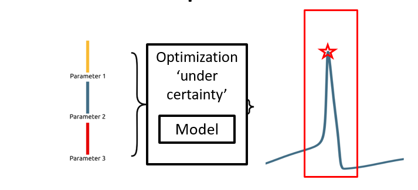
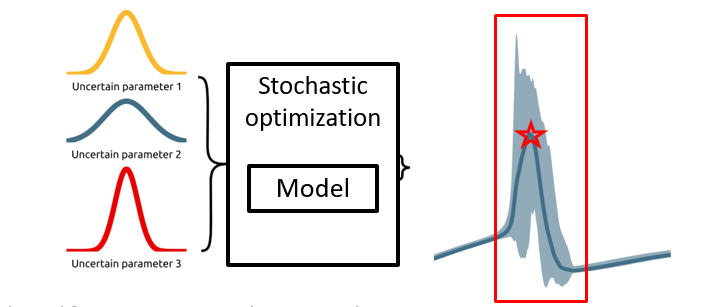
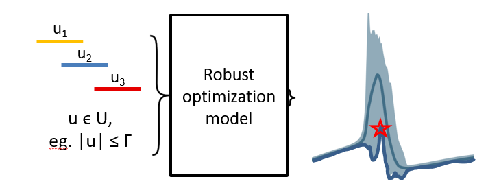

Why robust optimization? 
************************

Firstly, why optimization under uncertainty? Simply put,
we want to preserve constraint feasibility under perturbations of uncertain parameters,
with as little a penalty as possible to objective performance. In other words,
we want designs that protect against uncertainty *least conservatively*, especially when compared
with designs that leverage conventional design methods such as design with margins or multimission design.

RO introduces mathematical rigor to design under uncertainty, and aims to reduce the sensitivity of
design performance to uncertain parameters, thereby reducing risk.

Comparison of general SO methods with RO
========================================

|picOUC1| |picSO|

General optimization 'under certainty', eg. gradient descent, is done using methods that sample the
objective function, and use local information to converge towards an optimal solution.
Stochastic optimization uses the same principles, but with the addition of uncertain
parameters sampled from distributions. It then optimizes for some characteristic of the distribution
of the objective, such as some risk measure or expectation.

Stochastic optimization has many benefits. It makes best use of available data
about parameters, and it is extremely general. However, design outcomes can be
significantly affected by the ability to sample from the parameter distribution, which
in many cases is not well known. An even worse prospect for SO is the combinatorics
and computational cost of probability distribution function (PDF) propagation through problem physics.
The propagation of probability distributions of parameters
requires the integration of PDFs with objective and constraint
outcomes. Since this is difficult, this is often achieved
through high-dimensional quadrature and the enumeration of
potential outcomes into scenarios. And even so, SO has big computational requirements.

|picOUC2| |picRO|

RO takes a different approach, choosing to optimize designs for worst-case objective outcomes
over well-defined uncertainty sets. RO takes advantage of mathematical structure, requiring that
the design problem is formulated as a program that has a tractable robust counterpart,
such as an LP, QP, SDP, GP or SP. This is restrictive, but many engineering
problems of interest can be formulated in these forms, with some significant benefits over general SO.

Within RO, the problem is monolithic; there is sampling from probability distributions, no
separate evaluation step and optimization loop. RO problems are deterministic, with probabilistic guarantees
of feasibility, and solve orders
of magnitude faster than SO formulations with the same constraints. Furthermore,
only the mild assumption of bounded uncertainty sets is required;
no problem-specific approximations, assumptions or algorithms are needed.
Any feasible GP or SP can be solved as an RO problem. As such, RO is especially
suited to problems that are data deprived, such as conceptual design problems.
